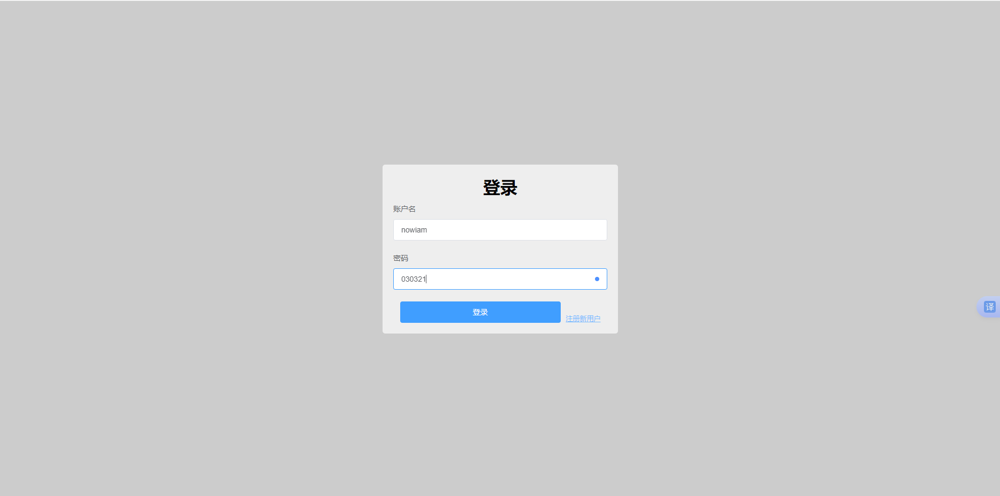
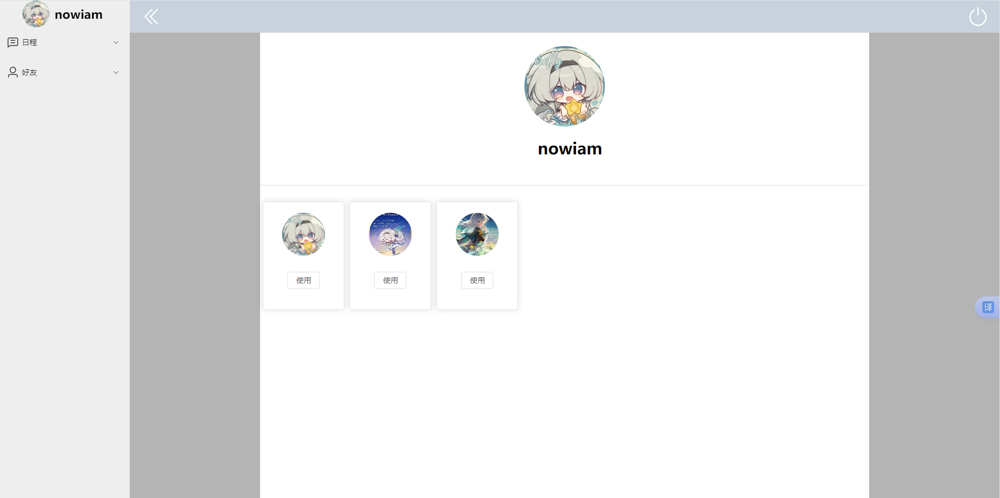
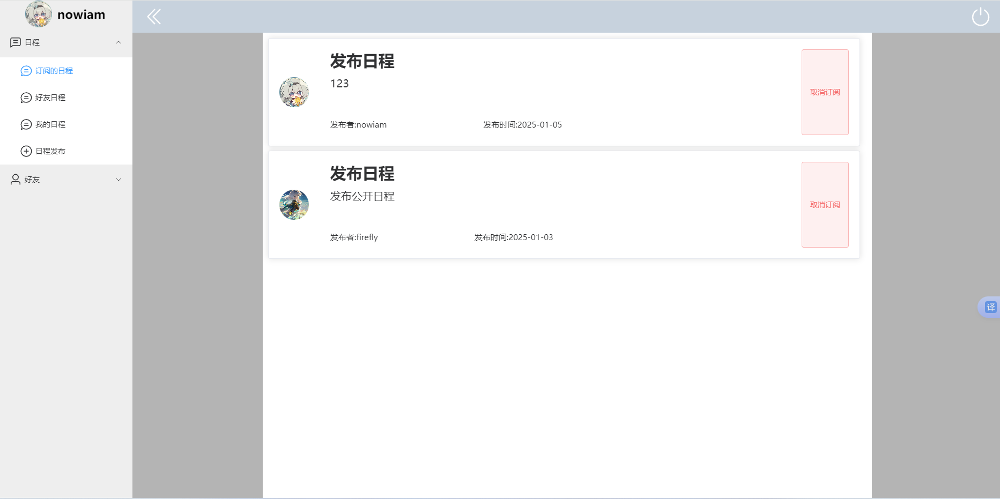
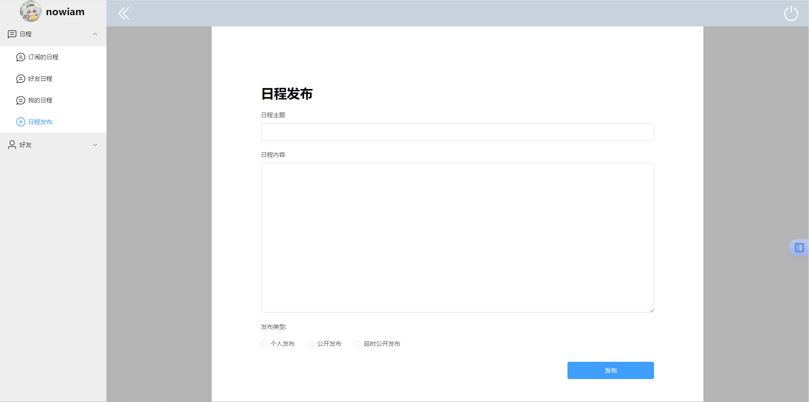

## 友程共享项目

设置过滤器实现基于 Token 的登录校验,使 Redis 实现分布式 Session ，并结合 ThreadLocal 实现对请求用户信息的解析  

实现日程发布，使用 RocketMq 实现延时发布日程，配合 Redis 实现类雪花算法获取唯一 id,并使用获得的 id 实现消息 幂等性防止消费者重复消费，开启线程池，对日程的发布删除进行多线程处理，优化用户体验

使用 Redis+MySQL 实现朋友功能,配置 Redis 主从集群，实现读写分离，容灾备份，保证可用性，用户可向别的用户请求添加好友，查看好友日程，订阅其感兴趣或相同的日程，发布者可选择日程好友可不可见

使用 Redis+Aop+Annotation 实现添加注解自动缓存数据,使代码专注于数据处理,同时防止缓存穿透,使用延时双删保证数据一致性

使用 Redis+Lua 脚本实现分布式锁,同时设置分布式锁超时与释放,经过 Jmeter 压力测试，保证了头像购买功能高并发

